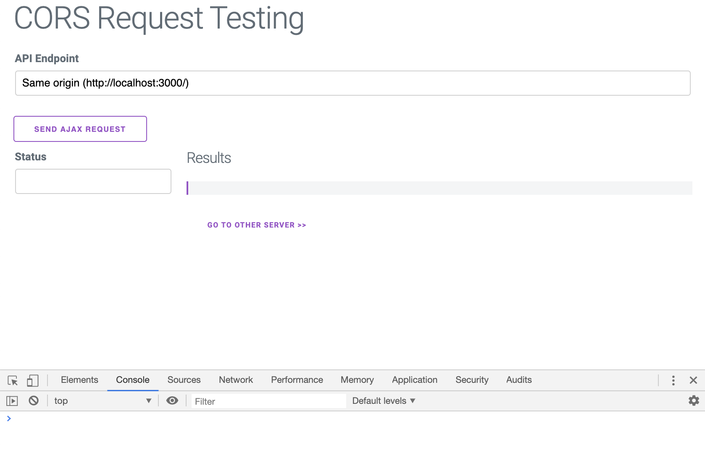
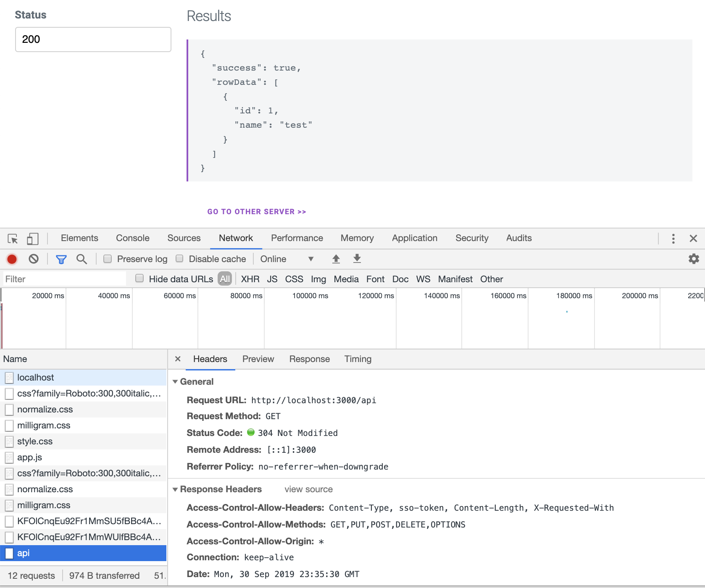
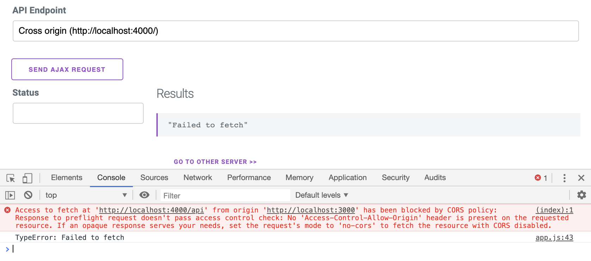
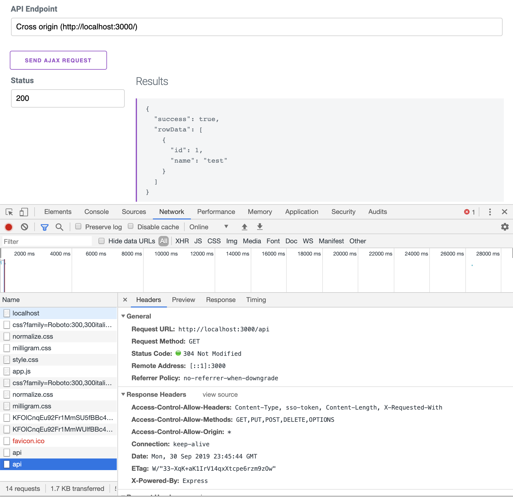

# CORS Example
This is an example Express JS app that shows how CORS works.

## Install
Clone the repo
```
git clone https://github.com/chilledoj/cors_example
cd cors_example
```
Install node_modules dependencies
```
npm install
```
Run
```
npm run start
```

## How to use
The `npm run` script will start 2 HTTP listeners - one on port 3000 and the other on port 4000.

The first server on port `3000` has CORS enabled, but the other does not.

Open `http://localhost:3000/` in your browser. Open dev tools as well so that you can see the console and inspect the requests.



The default API endpoint will be the same origin. Press the Send Ajax Button and the response will be shown.



Now change the API Endpoint to the "Other Origin" (port 4000) and try pressing the button again.



You'll notice that the request fails due to CORS.

You can inspect the request headers within the network tab of the browser devtools and you should see that, at first, an `OPTIONS` method request is made to the other server. This is called the `pre-flight` request.

Click the link to switch to the other server. And again switch the API endpoint to the other server (3000). Press the button to send the api request and notice that this now succeeds.



## How does this work
The `pre-flight` request will send an `OPTIONS` method request to the same endpoint - headers and data **not** included. The server is then able to respond back with headers which determine the:
+ Origins,
+ Headers, and
+ Methods

that are allowed at the requested URL.

If the request that is being requested matches this response then the browser will continue...BUT...the server response must also contain the same CORS headers in the response.
This can be tested by commenting out [line 58](https://github.com/chilledoj/cors_example/blob/5ed5c2e2a7502f26747fae0df376b89fd6f4872f/server.js#L58) in server.js.

Within the code we create a simple CORS middleware to set the relevant CORS headers:
```js
  function cors(req,res,next){
    res.header('Access-Control-Allow-Origin', '*');
    res.header('Access-Control-Allow-Methods', 'GET,PUT,POST,DELETE,OPTIONS');
    res.header('Access-Control-Allow-Headers', 'Content-Type, sso-token, Content-Length, X-Requested-With');
    next()
  }
```
This is then utilised within the relevant routes. Firstly we mount the actual pre-flight request `OPTIONS` method.
```js
  // Mount the pre-flight request
  if(corsEnabled){
    app.options("/api", cors, function(req, res, next){
      console.log("OPTIONS route:",req.headers)
      res.sendStatus(200);
    });
  }
```
Then we include the CORS middelware on the actual API endpoint.
```js
  // API endpoint
  app.get("/api",
    ensureAuth, 
    /*
    This is key here, without sending the CORS headers the response will still fail.
    Based upon what is passed into the server we use the CORS middleware or just a passthrough
    */
    (corsEnabled)?cors:(req,res,next)=>next(),
    function(req,res){
      console.log("GET route:",req.headers)
      res.status(200).json({"success": true, rowData: [{id: 1, name: 'test'}]})
    }
  )
```


## Side notes
+ The above is a fairly verbose version of what is required. There are middleware packages available.
+ I've added in a custom header (`sso-token`) into the reqeust to the server. This is merely to assist with showing that headers may not necessarily be passed to the options route in the pre-flight request.
+ The `fetch` API does not handle the request failure due to CORS like a 400/500 response. It will throw an error which must be handled and hence no link back to the original response object to get things like the the status code etc.